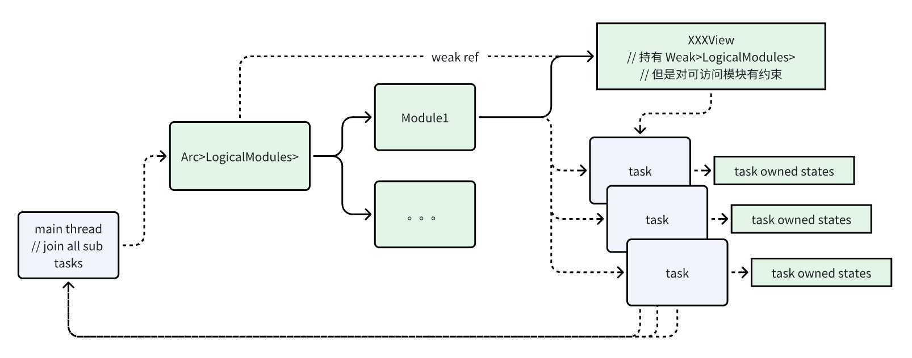
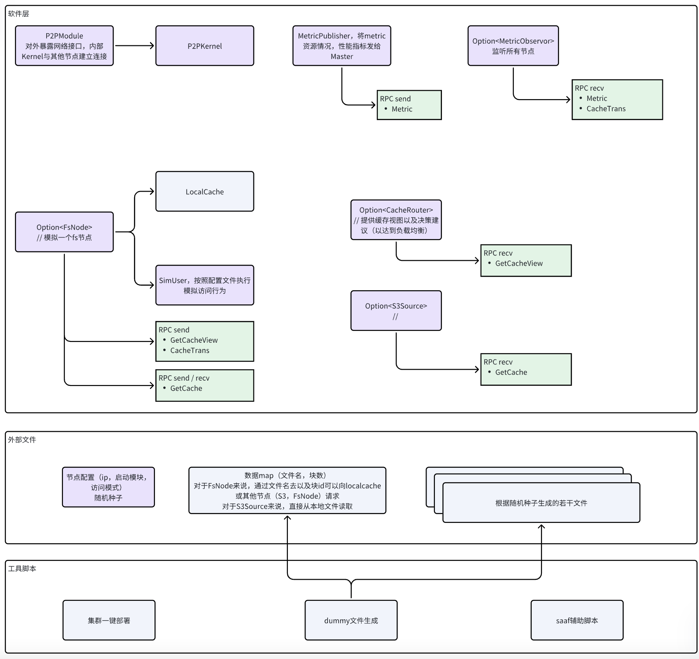

# perf_cache
## 总体模块组织关系

大部分相互访问的模块扁平存于LogicalModules中，每个模块通过view(对weak\<LogicalModules>的封装)访问其他模块



## 系统模块划分



## 设计思路
- 优化目标，在热点来临时，可以将缓存访问的负载分摊开。
- 执行过程：分为两个阶段，节点缓存准备阶段，用户在读的同时，也是对文件内容进行缓存准备的阶段，我们希望尽管最开始的流量全部往s3拿，后续多个节点具有缓存后，可以从其他有缓存的节点拿
- 难点以及ideas
  - 缓存位置的感知
    - 方案一：去中心的方式，向其他节点全部或部分问一遍
    - 方案二：中心路由，定期更新节点的缓存情况，对缓存访问进行智能路由
  - 路由策略，越智能的策略可以综合更多的因素（节点状态，带宽利用情况，缓存存活时长）
  - 链式或者树状转发会不会更好
  - 中心路由节点也可以有多个，通过hash分摊路由请求负载

## 最终roadmap
### 1.实现基本系统框架，分布式部署，部分代码移植自个人论文项目

- 分布式部署采用ansible，以及python脚本，保证了优雅方便的部署流程。

- 其中dockerfile，目标节点的nodeconfig等均为动态生成，以避免一些参数冗余和过期

- docker生成语句中预留了tc配置，后续进一步实验可以设置网络延迟以及带宽限制。
### 2.基本p2p

- config: 使用配置文件提供ip，节点id，节点功能信息（类似etcd作用）；

    spec字段说明对应的功能
    ``` yaml
    nodes: 
        1: 
            addr: 127.0.0.1:2000
            spec: [router,fs]
        2: 
            addr: 127.0.0.1:3000
            spec: [s3]
        3: 
            addr: 127.0.0.1:4000
            spec: [fs] 
    random_seed: hhhhh
    block_size: 1024
    ```
- network/msg_pack：使用protobuf进行通信包的序列化，使用trait绑定包id以及绑定rpc的request与response；
- network/p2p_quic：使用qp2p基于quic实现p2p通信；
- network/p2p：实现rpc和单向发送接口。

### 3. 按照系统模块划分中实现各个模块
- dummy_fs/cache_router: 

    收集每个节点的缓存情况，节点新缓存文件块时，加入对应文件块的缓存节点集合；节点淘汰文件块时，从缓存节点集合剔除。

    发送缓存访问视图CacheView，包括有缓存的节点以及优先偏移量。这是为了将每个请求的缓存访问错开，尽可能负载均衡。这也取决于偏移量的设置方法，目前仅采用了RoundRobin这种简单策略


- dummy_fs/fs_node:

    网络通信：需要向router发送GetCacheView请求；缓存变化（新增/淘汰某块）；处理来自其他节点的GetCacheRequest，读取本地的缓存

    提供用户接口读取文件块，以及获取文件块数，以便模拟用户进行数据访问，同时实现一些baseline对比策略。

- dummy_fs/s3_source

    处理来自其他节点的GetCacheRequest，读取之前随机生成的文件片段

- dummy_fs/sim_user

    SimUser与FsNode是绑定关系，即FsNode存在时就会产生一个SimUser，其访问模式由脚本生成的user.yaml决定
### 4. 实现生成脚本

scripts/generate_random_file.py

其会读取配置文件的随机种子，生成若干文件，并生成每个文件节点的访问模式（也可以手动写好，进行更细的控制）

### 5. 实验一
随机种子：hhhhh
数据块1MB

节点配置
``` yaml
5:
    access: loop
    targets:
        - mykbe.txt
        - hrtqr.txt
6:
    access: loop
    targets:
        - cyrsk.txt
        - ngwrj.txt
3:
    access: loop
    targets:
        - zytsk.txt
        - hbuzi.txt
        - mykbe.txt
        - hrtqr.txt
        - cyrsk.txt
        - ngwrj.txt
4:
    access: loop
    targets:
        - mykbe.txt
        - hrtqr.txt
        - cyrsk.txt
        - ngwrj.txt
        - zytsk.txt
        - hbuzi.txt
```

两个节点focus在两个文件上循环读，由于不超出缓存队列大小，所以总是能命中本地。

两个节点focus六个文件，其中四个为前两个节点focus的文件，由于超出了缓存容量又是循环访问模式，这两个节点始终不能命中自己的缓存，但我们希望其不总是请求s3，能直接从前两个有缓存节点拿

User单任务循环读

| 策略 | 平均每个节点rps |
|-----|-----|
| CacheRouter | ≈58 |
| AlwaysFromS3 | ≈53 |
| ForEachPeer(StartFromNext) | ≈70 |
| ForEachPeer(StartFromFirstFinalS3) | ≈56 |

User并发10任务循环读

| 策略 | 平均每个节点rps |
|-----|-----|
| CacheRouter | ≈64 |
| AlwaysFromS3 | ≈51 |
| ForEachPeer(StartFromNext) | ≈74 |
| ForEachPeer(StartFromFirstFinalS3) | ≈57 |

根据实验结果发现单点s3始终具有最不好的表现。因为单线程循环读总是要在上一次读完后开始下一次，CacheROuter至少需要查询两次，延迟上不占优势，但是通过设置并发可以看到CacheRouter与最优方案的差距缩小，因为User并发任务可以充分利用吞吐量。


### 6. 实验二

我们将尝试扩大规模，看看能否进一步拉开不同方案间的差距

node_config.yaml

``` yaml
nodes: 
  1: 
    addr: 192.168.31.162:2500
    spec: [router]
  2: 
    addr: 192.168.31.162:2505
    spec: [fs]
  3: 
    addr: 192.168.31.87:2500
    spec: [fs]
  4: 
    addr: 192.168.31.87:2505
    spec: [fs]
  5: 
    addr: 192.168.31.96:2500
    spec: [s3]
  6: 
    addr: 192.168.31.96:2505
    spec: [fs]
  7: 
    addr: 192.168.31.96:2510
    spec: [fs]
  8: 
    addr: 192.168.31.87:2510
    spec: [fs]
  9: 
    addr: 192.168.31.162:2510
    spec: [fs]
random_seed: hhhhh
block_size: 1024
```

user.yaml
``` yaml
2:
    access: loop
    targets:
        - mykbe.txt
        - hrtqr.txt
6:
    access: loop
    targets:
        - cyrsk.txt
        - ngwrj.txt
3:
    access: loop_parallel
    targets:
        - zytsk.txt
        - hbuzi.txt
        - mykbe.txt
        - hrtqr.txt
        - cyrsk.txt
        - ngwrj.txt
4:
    access: loop_parallel
    targets:
        - mykbe.txt
        - hrtqr.txt
        - cyrsk.txt
        - ngwrj.txt
        - zytsk.txt
        - hbuzi.txt
7:
    access: loop_parallel
    targets:
        - mykbe.txt
        - hrtqr.txt
        - cyrsk.txt
        - ngwrj.txt
        - zytsk.txt
        - hbuzi.txt
8:
    access: loop_parallel
    targets:
        - mykbe.txt
        - hrtqr.txt
        - cyrsk.txt
        - ngwrj.txt
        - zytsk.txt
        - hbuzi.txt
9:
    access: loop_parallel
    targets:
        - mykbe.txt
        - hrtqr.txt
        - cyrsk.txt
        - ngwrj.txt
        - zytsk.txt
        - hbuzi.txt
```

User并发10任务循环读

| 策略 | 平均每个节点rps | 命中查询次数 |
|-----|-----|-----|
| CacheRouter | ≈46 | 2 |
| AlwaysFromS3 | ≈28 | 1 |
| ForEachPeer(StartFromNext) | ≈50 | 1.68 |
| ForEachPeer(StartFromFirst) | ≈47.8 | 1.72 |

根据实验结果看到在多数节点需要数据相近时，缓存命中率较高，依次查询其他节点可能有更高的命中率，相对来说CacheRouter则一定要查询两次，因此没有达到最优，我们将尝试插入干扰组，看看相邻节点难以命中情况下，不同策略表现的对比，以及能否展现CacheRouter的优势

### 7. 实验三

user.yaml
``` yaml
8:
    access: loop
    targets:
        - mykbe.txt
        - hrtqr.txt
6:
    access: loop
    targets:
        - cyrsk.txt
        - ngwrj.txt
3:
    access: loop_parallel
    targets:
        - zytsk.txt
        - hbuzi.txt
        - mykbe.txt
        - hrtqr.txt
        - cyrsk.txt
        - ngwrj.txt
4:
    access: loop_parallel
    targets:
        - rndva.txt
        - ngwrj.txt
        - jhdeg.txt
        - zytsk.txt
        - mykbe.txt
        - hbuzi.txt
        
7:
    access: loop_parallel
    targets:
        - zytsk.txt
        - hbuzi.txt
        - mykbe.txt
        - hrtqr.txt
        - cyrsk.txt
        - ngwrj.txt
2:
    access: loop_parallel
    targets:
        - rndva.txt
        - ngwrj.txt
        - jhdeg.txt
        - zytsk.txt
        - mykbe.txt
        - hbuzi.txt
9:
    access: loop_parallel
    targets:
        - zytsk.txt
        - hbuzi.txt
        - mykbe.txt
        - hrtqr.txt
        - cyrsk.txt
        - ngwrj.txt
```

| 策略 | 平均每个节点rps | 命中查询次数 |
|-----|-----|-----|
| CacheRouter | ≈106 | 2 |
| AlwaysFromS3 | ≈26.5 | 1 |
| ForEachPeer(StartFromNext) | ≈50 | 3.84 |
| ForEachPeer(StartFromFirst) | ≈50 | 2.61 |

我们通过间隔设置节点访问相同数据，相邻节点访问不同数据来扰乱ForEachPeer模式的命中率，由实验结果可见，CacheRouter稳定的保证了两次查询就能得到缓存，并且有较高的吞吐量

### 8. 总结
本项目完成了基本分布式文件系统模拟，通过quic以及protobuf实现节点间p2p通信，给出完整部署方案，集成metric能力。给出了具有一定创新性的缓存路由模式，避免进行多余的cache查询，这可以减少系统流量，同时有希望支持进一步更智能的负载均衡策略。

局限性：

- 缓存路由总是至少需要两次次查询，可以将部分路由信息主动更新到目标节点。

- 在更大的规模下，路由节点会成为性能瓶颈，可以设置多个路由节点，使用hash映射到多个路由节点来分摊路由负载。